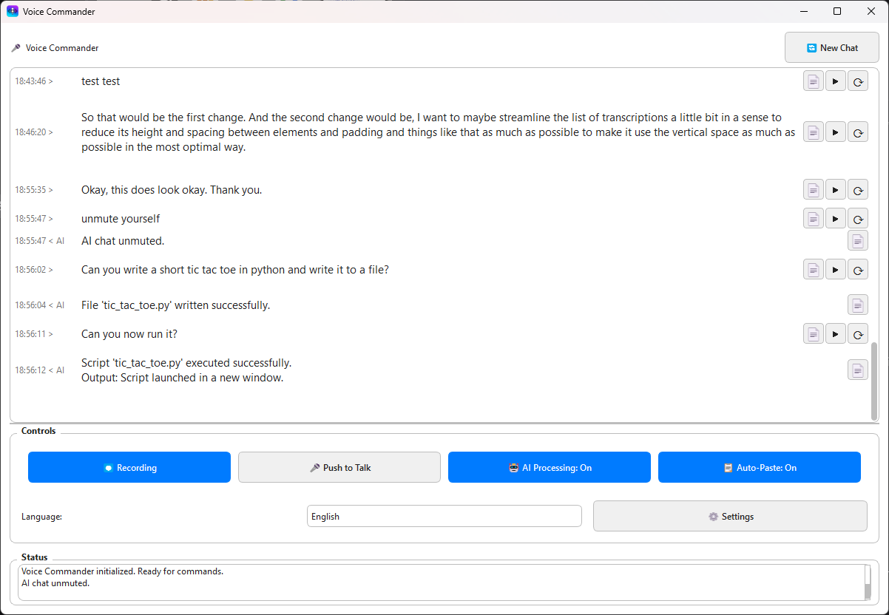

# Voice Commander

A voice-controlled assistant with a Qt-based user interface that listens to your microphone, transcribes audio into text, and processes commands through a language model.


*Voice Commander - Clean Qt interface with transcription, LLM processing, and customizable settings*

## Features

- **Speech Recognition**: Real-time transcription of speech to text
- **Push to Talk Mode**: Toggle between voice-activated and push-to-talk recording
- **Automatic Clipboard Integration**: Automatically copies transcribed text to clipboard with optional paste
- **LLM Command Processing**: Process natural language commands with Groq API
- **Script Generation & Execution**: LLM can write and run scripts automatically
- **Script Error Detection & Fixing**: Automatically detects and fixes errors in scripts
- **Multi-language Support**: Switch to any language
- **Sound Notifications**: Audio feedback when speech is recognized
- **Microphone Selection**: Choose from available audio input devices
- **Persistent Settings**: Application remembers your preferences between sessions
- **Qt-based User Interface**: Clean and responsive graphical interface

## Installation

```bash
pip install .
```

This will install Voice Commander and make the `vc` command available system-wide. The installation process sets up the necessary Python package and creates an executable entry point so you can launch the application from any terminal.

## Configuration

Before using Voice Commander, you need to configure your settings in the `config.py` file:

1. **Required**: Set your Groq API key
   ```python
   GROQ_API_KEY = 'your-groq-api-key'  # Required for transcription and LLM features
   ```

2. **Optional**: Configure folder locations for saved files
   ```python
   AUDIO_FILES_SAVE_FOLDER = "/path/to/save/audio/files"
   CHAT_HISTORY_SAVE_FOLDER = "/path/to/save/chat/history"
   LLM_SANDBOX_WORKING_FOLDER = "/path/to/llm/sandbox"
   ```

## Running

You can run Voice Commander in two ways:

### Using the installed command (after pip install)

```bash
vc [-d DEVICE_INDEX] [-v]
```

### Running directly from the source

```bash
python voice_commander.py [-d DEVICE_INDEX] [-v]
```

Where:
- `-d DEVICE_INDEX` or `--device DEVICE_INDEX`: Specify the audio input device index or name to use
- `-v` or `--verbose`: Enable verbose output for debugging

## Usage

1. **Start the application**: Launch the application using the command above
2. **Select a microphone**: Choose your preferred audio input device from the dropdown
3. **Start speaking**: The application will automatically transcribe your speech
4. **Use Push to Talk**: Click the Push to Talk button when you want to speak and click it again when done
5. **Use LLM commands**: Speak commands to control the application or perform tasks
6. **Toggle features**: Use the buttons in the UI to toggle features like muting or automatic paste

## UI Controls

- **Stop/Start Transcription**: Pause or resume the audio transcription
- **Push to Talk**: Toggle between push-to-talk and voice-activated modes
- **Mute/Unmute LLM**: Toggle the LLM response on or off
- **Enable/Disable Paste**: Toggle automatic pasting of transcribed text
- **Reset Chat**: Clear the chat history and start a new conversation
- **Language Selection**: Choose your preferred language
- **Microphone Selection**: Select your audio input device


## Interface

The Voice Commander application features a clean, intuitive interface divided into two main sections:

### Conversation Area
- Displays transcribed speech and AI responses
- Chat history with color-coded messages (user speech in gold, AI responses in blue)
- Reset button to clear conversation history

### Controls Section
- **Main Controls**: Recording toggle, Push to Talk, AI Processing toggle, and Auto-Paste toggle
- **Language Selection**: Switch between different languages for transcription
- **Microphone Selection**: Choose from available audio input devices
- **Status Area**: View real-time feedback and error messages

The interface is designed to be straightforward while providing access to all necessary controls and feedback. The main window is resizable, with the conversation area automatically expanding to use available space.

## Recent Updates

### March 2025 Updates

1. **Push to Talk Feature**:
   - Added button to toggle between voice-activated and push-to-talk modes
   - Improved user control over when audio is being recorded and processed

2. **Consolidated UI**: Application has been fully converted to a Qt-based interface
   - Improved user experience with intuitive controls
   - Better status feedback and error reporting

3. **Improved Microphone Handling**:
   - Fixed issues with microphone switching
   - Added proper buffer reset when changing devices
   - Enhanced error handling for audio streams

4. **Persistent Settings**:
   - Added persistence for mute/unmute state
   - Added persistence for automatic paste settings
   - Implemented window position and size memory

5. **Audio Processing Enhancements**:
   - Improved short audio detection and handling
   - Better synchronization between audio and transcription
   - Enhanced error handling for audio stream issues

## Troubleshooting

If you encounter issues:

1. **Audio Transcription Problems**:
   - Make sure your microphone is working correctly
   - Check that you've selected the correct device in the dropdown
   - Speak clearly and at a normal volume

2. **Application Errors**:
   - Run with the `-v` flag to enable verbose output
   - Check the status area in the application for error messages

3. **LLM Command Issues**:
   - Verify your Groq API key is correctly set
   - Ensure you have an internet connection for API access

## Credits

100% of the code in this project was written by AI, mostly by Claude 3.5 and 3.7 Sonnet, and some by Gemini 2.5 Pro.


## License

MIT License
